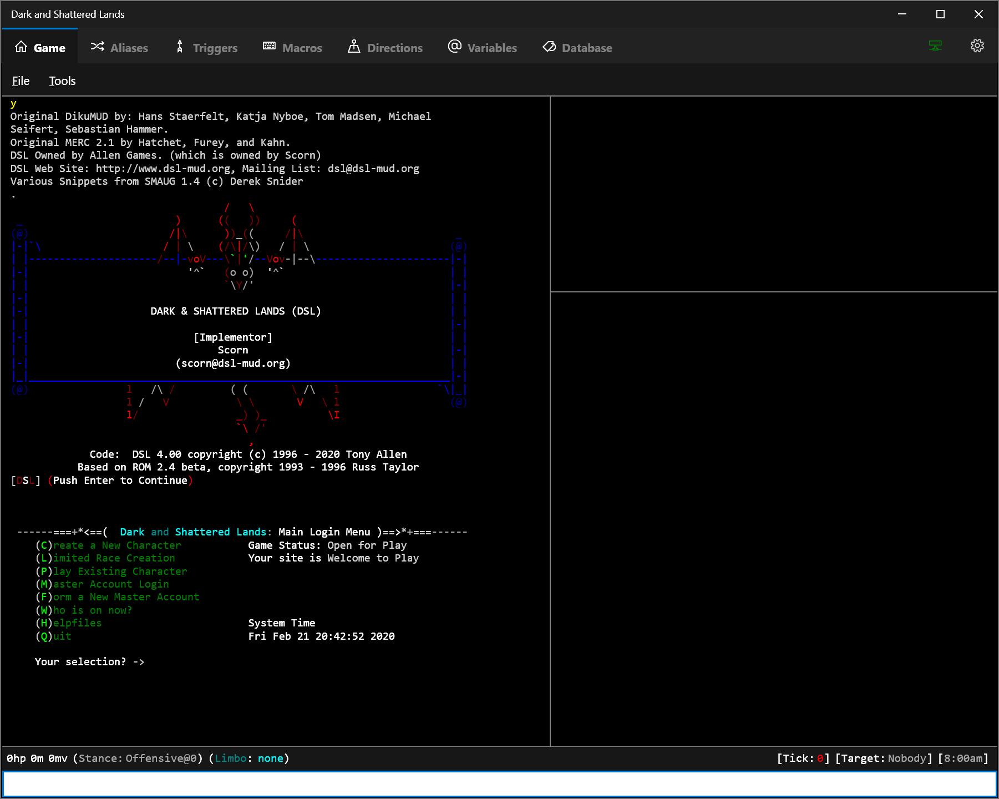

# Avalon Mud Client

A Windows MUD (multi-user dimension) client that allows you to connect to and play any number of text based online multi user games.

[Screenshots](doc/Screenshots.md)

### Documentation

- [Installation](doc/InstallationInstructions.md)
- [Quick Tips for Getting Started](doc/QuickTips.md)
- [FAQ](doc/FAQ.md)
- [Aliases](doc/Aliases.md)
- [Hash Commands](doc/HashCommands.md)
- [Lua](doc/Lua.md)
  - [Lua Overview](doc/Lua.md)
  - [Lua Extensions](doc/LuaExtensions.md)
  - [Lua Examples](doc/LuaExamples.md)
- Macros
- [Packages](doc/Packages.md)
- Plugins
- Triggers
- [Variables](doc/Variables.md)

### Info

 - Language: C# / WPF for .Net 6
 - OS Support: Windows 7, 8.1, 10 (1607+)

### Key Features
 
 - Aliases
 - Triggers (simple and regular expression)
 - Macros
 - Package Manager for installing packages that are built for a specific game.
 - LUA (LUA can be inlined as the output of an alias or a trigger)
 - Colored syntax editor for LUA with intellisense (code completion) for all of the extended API's.
 - 4K monitor support / responsive UI design.
 - Touch screen friendly.
 - SQLite Database Builtin with syntax highlighted query editor.  Database/query editor with a color coded editor and auto completion built in.
 - Profiles can be used for multiple characters (any trigger or alias can be set to only run for certain characters).
 - Directions support
 - Global variable support in and outside of LUA that persists beyond mud sessions (Avalon also has temp variable support). 
 - Plugin ability (extend Avalon by writing your own C# or Lua plugins)
 - Custom scraping that can be easily turned on and off via hash commands/LUA and then piped to variables (imagine an alias that scraped notes into a database for posterity, etc.).
 - Tick support.
 - Gagging, redirection and custom information panels.
 - Regular Expression tester.
 
### Open Source Libraries used in Avalon

 - [AvalonEdit](https://github.com/icsharpcode/AvalonEdit) (MIT)
 - [ModernWpfUI](https://github.com/Kinnara/ModernWpf) (MIT)
 - [MoonSharp](https://github.com/moonsharp-devs/moonsharp) (Custom License, see project)
 - [Command Line Parser](https://github.com/commandlineparser/commandline) (MIT)
 - [Argus Framework](https://www.github.com/blakepell/ArgusFramework) (MIT)
 - [WPF-AutoComplete-TextBox](https://github.com/quicoli/WPF-AutoComplete-TextBox) (MIT)
 - [TentacleSoftware.Telnet](https://github.com/Spksh/TentacleSoftware.Telnet) (Apache v2)
 - [RestSharp](https://github.com/restsharp/RestSharp) (Apache v2)
 - [JSON.Net](https://github.com/JamesNK/Newtonsoft.Json) (MIT)
 - [MahApps.Metro.IconPacks](https://github.com/MahApps/MahApps.Metro.IconPacks) (MIT)
 - [Dapper] (https://github.com/StackExchange/Dapper) (Apache v2)
 - [XamlFlair] (https://github.com/XamlFlair/XamlFlair) (MIT)

### Short Term Road-map

 - Documentation
 - Ensure touch screen scrolling is smooth on all terminals and controls.

### Long Term Road-map

 - Publish this app on the Windows Store free of charge.

### Recognition / Thank you to testers

[Thank You](/doc/Thanks.md)

### License
 
 The Avalon Mud Client is being released under a modified MIT license with an additional clause requiring credit to the original author (Blake Pell).  E.g. this means the license should be flexible enough to do what you need to do with it.