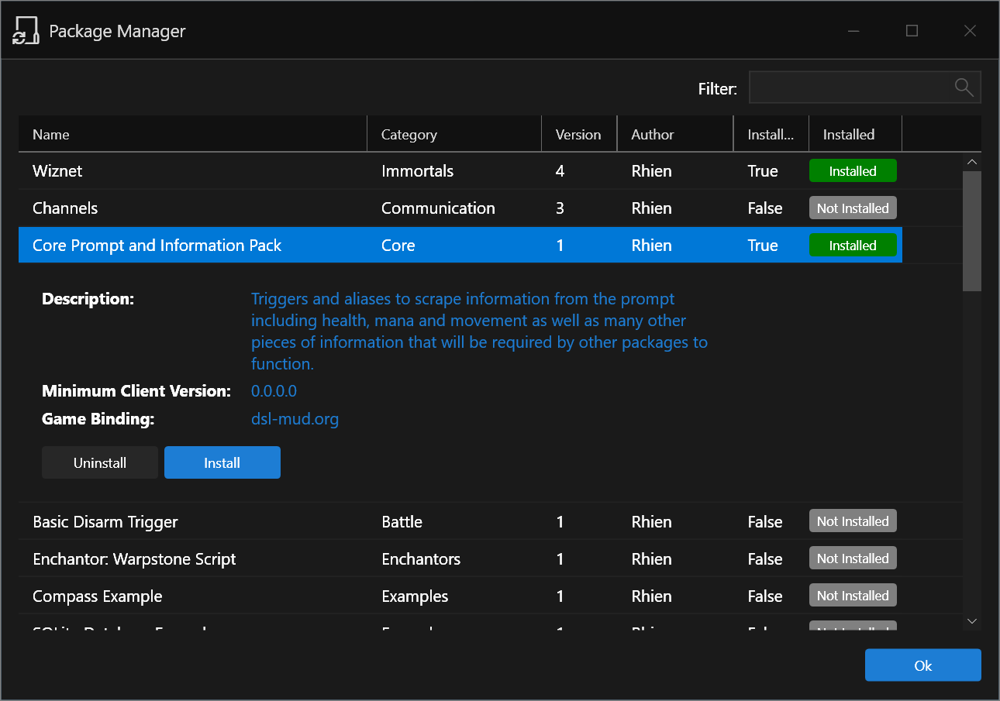

# Avalon Mud Client

## Installation Instructions

The latest 32-bit and 64-bit releases/installation packages are available here:

[Releases](https://github.com/blakepell/AvalonMudClient/releases)

**Note**: The installation package is not currently signed with a code signing certificate and as a result Windows may say it is untrusted.

## Installation Notes for dsl-mud.org

 - After start the client for the first time, choose `Help->Update Plugins Only`.  This will download menu options, hash commands and lua extensions that are specific to DSL.  Restart the client after this.
 - Now, to choose your initial alias and trigger packages go under `Edit->Package Manager`.  At a minimum you should install the `Core Prompt and Information Pack`.  This includes all of the triggers necessary to move DSL's channels into the information panels on the right hand side of the client as well as setup the prompt (if you're logged into the game) and scrape info like HP/Mana/Room from it (many of the additional triggers build off of these variables).

The package manager will allow you to install and uninstall updates so you can try or demo features and if you don't like them you can easily remove them.

[Package Manager Documentation](/Packages.md)