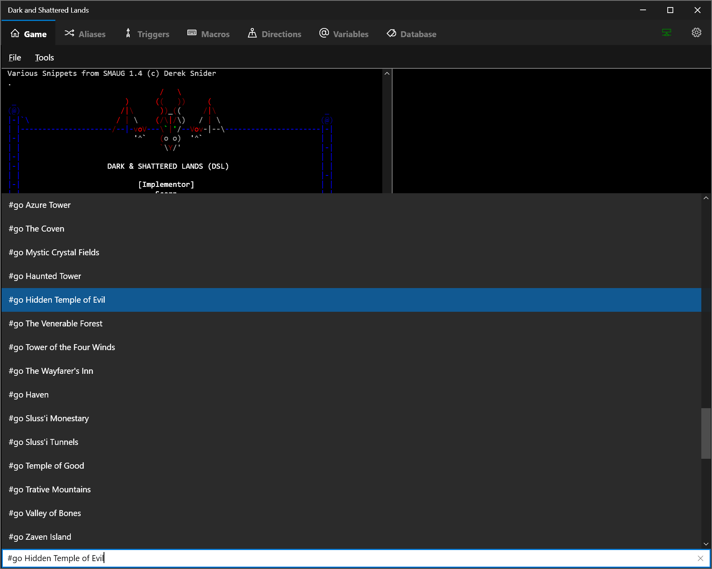
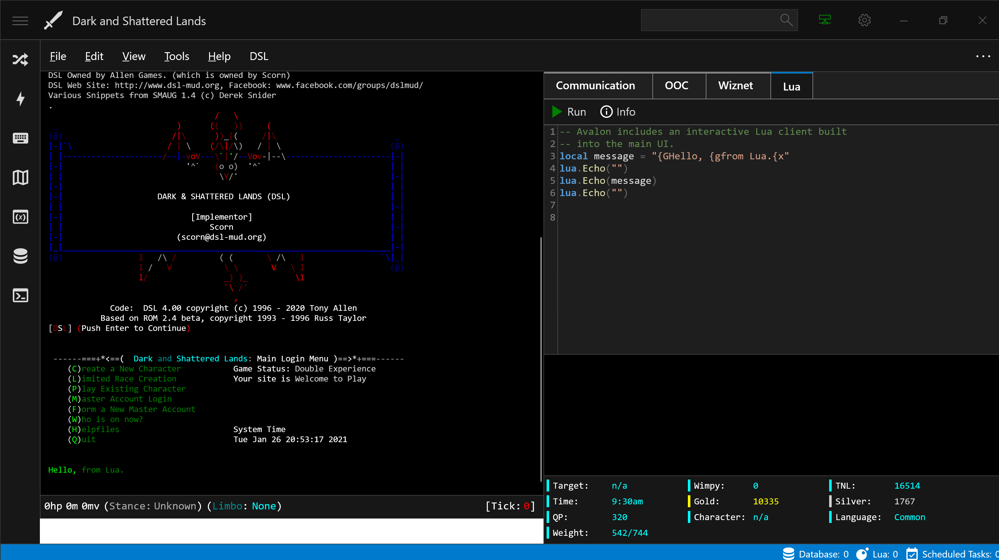
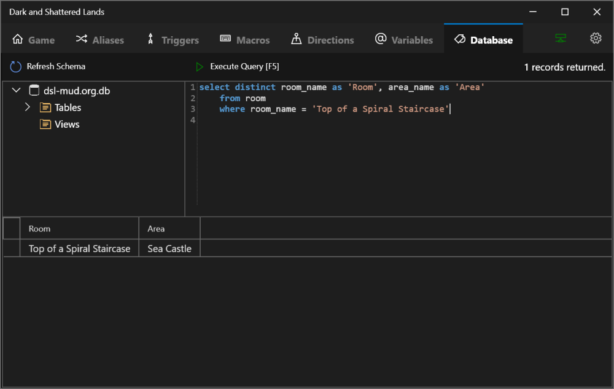
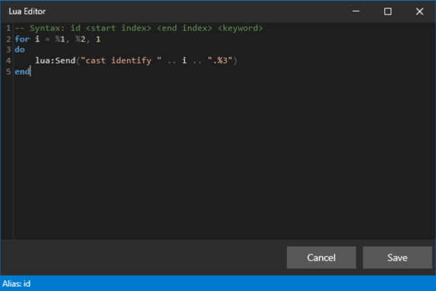

# Avalon Mud Client

## Screenshots

### Main Terminal

*The client is being developed as a generic mud client that can be packaged for a specific mud out of the box so a player can download the client and not have to spend lots of time setting up all of the basic scripts, aliases, triggers and other content they need.  The idea is that it goes above and beyond for a new mud player.  This project will have an highly tailored plugin for dsl-mud.org as a model others can expand on or adapt.*

*As nearly all text based games have directions and massive worlds, the ability to navigate has been built in (and will be expanded).  If the client knows what room your in it can assist in stringing together sets of directions to make a massive world much easier to navigate.*

*Text can be redirected to other panels via triggers*

### Database Support / SQL Editor (SQLite)

*A SQLite database is setup by default with every profile.  Custom plugins can be loaded that create tables and allow for crowd sourcing of game data from directions, to wiki entries, to additional help files, to in game history.*

### Lua Syntax Highlighting

*The Lua language has been extended with ease of life functions that will be useful if you're a scripter*